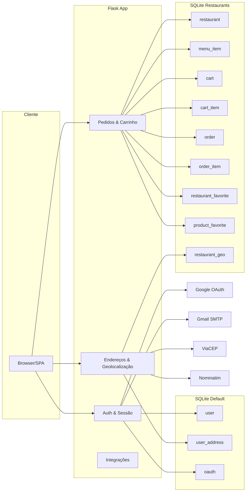

# Arquitetura do Sistema

- Hosts e SO: Windows (desenvolvimento local), Flask 2.3, SQLite.
- Componentes: Flask, Flask-Login, Flask-SQLAlchemy, Flask-Dance, Flask-Mail.
- Integrações: Google OAuth, Gmail SMTP, ViaCEP, Nominatim.
